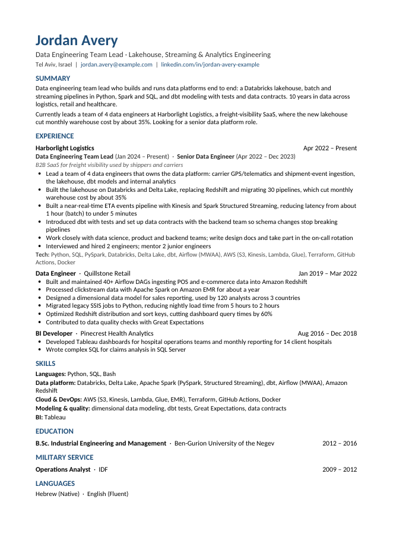

# cv-refresh

A [Claude skill](https://support.claude.com/en/articles/12512180-using-skills-in-claude) that
updates your CV so you don't have to. Hand it your current CV, optionally a job posting,
and answer a handful of short questions. It writes a 1-2 page CV, generic or tailored,
proofreads it, and scores how well it matches the job.

Built for the moment every job search starts with: *"ugh, my CV still describes the job
I had three years ago."*



*Fictional example. See [`examples/tailored-jordan/`](examples/tailored-jordan/) for the full session.*

## What it does

- **Reads your existing CV**: PDF, DOCX, Markdown, or a LinkedIn profile PDF export.
- **Interviews you briefly** about your current role: it tells you up front how many
  questions it has, and every question is yes/no, multiple choice or one line, and
  skippable. A short follow-up round comes after. Then it offers to go over earlier
  roles by name.
- **Writes the CV**: a short TL;DR summary at the top, rewritten bullets, US English,
  and a hard cap of 2 pages.
  - **Generic** if you give no posting.
  - **Tailored** if you give a job posting (URL or pasted text). It's free to rewrite
    the whole CV toward the job.
- **Keeps it honest.** It never invents numbers, skills or responsibilities. Employers,
  official titles, dates and degrees stay as they are. A checker script flags any number
  that isn't in your CV or your answers.
- **Keeps your layout or lets you choose.** It asks once, then remembers: mirror your
  current CV's look, or pick from 4 layouts each time. Output is always DOCX + PDF.
- **Reviews its own work**: spelling and grammar fixes, suggestions, and a before/after
  match score against the posting, all in chat. Nothing is ever left as comments
  inside your document.
- **Remembers**: every session's questions, answers and changes are kept as history,
  so next time it only asks what changed.

## Install

### claude.ai / Claude Desktop

1. Download `cv-refresh.skill` (or `cv-refresh.zip`) from the
   [Releases](../../releases) page, or build it with `python3 tools/package.py`.
2. Make sure **Code execution and file creation** is enabled in Settings → Capabilities.
3. Go to **Customize → Skills** (on some plans and versions: **Settings → Capabilities →
   Skills**), click **Upload skill**, and choose the file. Opening a `.skill` file that
   Claude sends you in chat and clicking **Save skill** also works.

The claude.ai sandbox resets between chats, so at the end of each session the skill
gives you `cv-refresh-user-data.zip` (your settings and history). Upload it with your CV
next time.

### Claude Code

```bash
git clone https://github.com/<your-github-user>/cv-refresh.git
cd cv-refresh
./tools/install-claude-code.sh          # symlinks skills/cv-refresh into ~/.claude/skills/
# or: cp -r skills/cv-refresh ~/.claude/skills/
```

Requirements on your machine:

| | Needed for | Install (macOS) |
|---|---|---|
| Python 3.9+ | everything | preinstalled / `brew install python` |
| `python-docx` | writing the DOCX | `pip install python-docx` |
| `pdfplumber` (or `pypdf`) | reading PDFs, detecting layout | `pip install pdfplumber` |
| LibreOffice | PDF output and the 2-page check | `brew install --cask libreoffice` |
| Poppler (optional) | page previews | `brew install poppler` |

Run `python3 skills/cv-refresh/scripts/doctor.py` to check.

## Use it

Just talk to Claude. For example:

- "My CV is out of date. Here it is, update it with my current job."
- "Tailor my resume to this posting: https://…"
- "Here's my LinkedIn PDF, turn it into a proper CV for this job: *(pasted text)*"
- "Change my CV layout setting."

LinkedIn job links often hide the description behind a login. When that happens, the
skill asks you to paste the text. There's no LinkedIn API option: free LinkedIn developer
accounts can't read job postings (details in [DESIGN.md](DESIGN.md#linkedin)).

## Your data

Your CV content, answers and history are personal, so they stay in a git-ignored data
directory:

- Claude Code: `skills/cv-refresh/user-data/` (`settings.json`, `history/`, `work/`),
  or wherever `$CV_REFRESH_HOME` points
- claude.ai: temporary, exported as `cv-refresh-user-data.zip` at the end of a session

Packaging (`tools/package.py`) always excludes `user-data/`. Nothing is sent anywhere
except the job-posting URL you ask it to fetch.

## Repository layout

```
skills/cv-refresh/        the skill itself (this is what gets installed)
  SKILL.md                workflow and ground rules
  references/             interview, writing, review, posting, schema and history guides
  scripts/                deterministic helpers (extract, style, render, lint, keywords, state)
evals/                    test prompts, fixtures (fictional), objective checks
examples/                 two full simulated runs with intermediate files and outputs
tools/                    packaging and install scripts
DESIGN.md                 design, decisions, and the prompt to rebuild the skill from scratch
STATUS.md                 current state, test results, known limitations, roadmap
CHANGELOG.md              technical change history
RELEASE_NOTES.md          user-facing notes per release
```

## Development

```bash
python3 evals/fixtures/make_fixtures.py        # regenerate the fictional test CVs
python3 evals/check_outputs.py --help          # objective checks for a run's outputs
python3 tools/package.py                       # validate and build dist/cv-refresh.{skill,zip}
```

To test a change, run the prompts in `evals/evals.json` with the skill installed,
playing the user from `evals/fixtures/simulated-user-jordan.md`, then run
`check_outputs.py` on the results. The checks cover what must never regress: the page
cap, no invented numbers, US spelling, preserved facts, no comments in the document.
Writing quality still needs a human read.

**Releasing:** bump `metadata.version` in `skills/cv-refresh/SKILL.md` (the single source
of truth; scripts read it), add entries to `CHANGELOG.md` and `RELEASE_NOTES.md`, update
`STATUS.md`, then run `tools/package.py`, commit, tag `vX.Y.Z`, and attach
`dist/cv-refresh.skill` and `dist/cv-refresh.zip` to the GitHub release.

Contributions are welcome. Please keep the ground rules in `SKILL.md` intact, since they're
what makes the output safe to send to an employer.

## License

[MIT](LICENSE)
